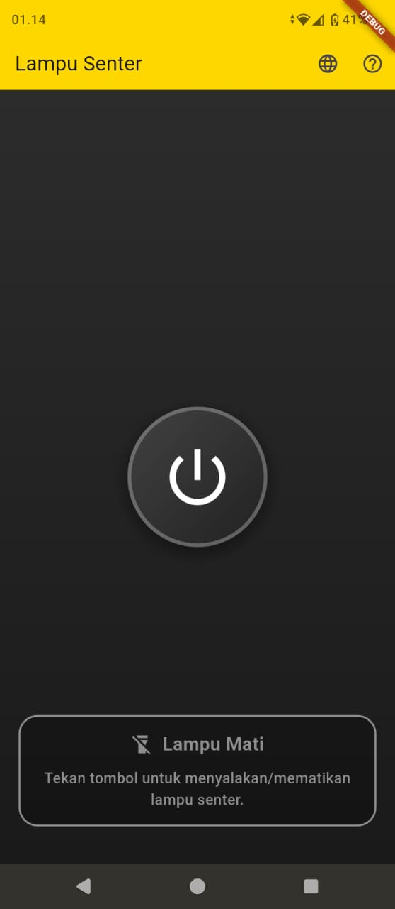
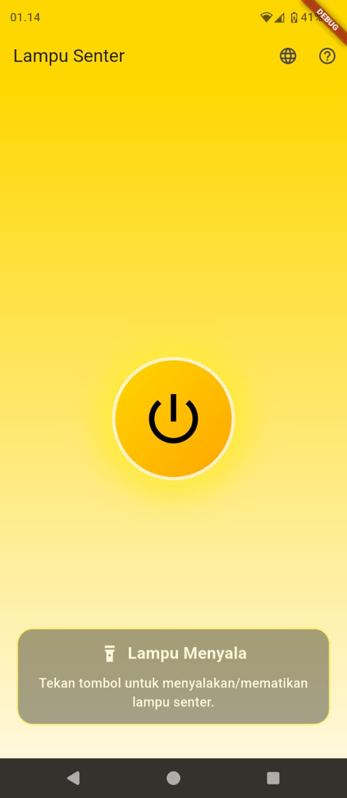
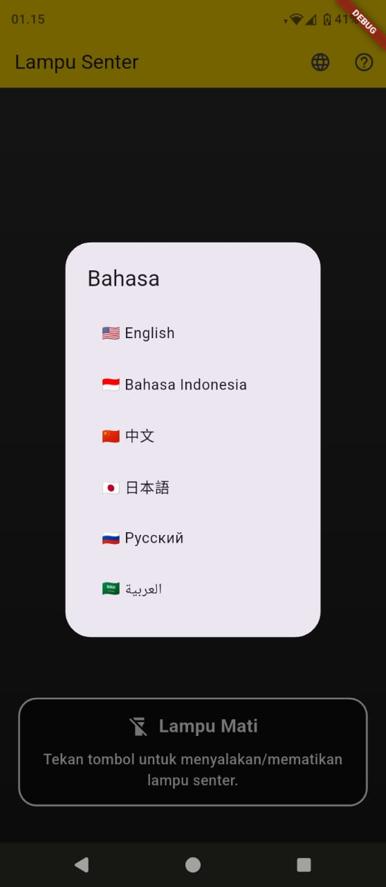

<div align="center">

**选择语言**

点击语言选项切换语言。

[English](README.en.md) | [Bahasa Indonesia](README.md) | [Русский](README.ru.md) | [日本語](README.ja.md) | [中文](README.zh.md) | [العربية](README.ar.md)

</div>

# 手电筒应用

基于Flutter的简单手电筒应用，以黄色香蕉主题设计。该应用允许用户打开相机闪光灯作为光源，具有直观的界面和多语言支持。

## 主要功能

- **手电筒控制**: 电源按钮打开/关闭相机闪光灯。
- **动态动画**: 灯光开启时的光晕和渐变效果的平滑过渡。
- **多语言**: 支持6种语言: 印尼语、英语、普通话、日语、俄语和阿拉伯语。
- **AdMob广告**: 退出应用时的插页广告集成，用于货币化。
- **响应式**: 适应各种屏幕尺寸和虚拟导航按钮的设计。
- **启动画面**: 带有OpenMoji图标的启动画面。

<div align="center">

**选择语言**

点击语言选项切换语言。

- [English](README.en.md) | [Bahasa Indonesia](README.md) | [Русский](README.ru.md) | [日本語](README.ja.md) | [中文](README.zh.md) | [العربية](README.ar.md)

</div>

## 截图

| 截图 1 | 截图 2 |
|--------|--------|
|  |  |

| 截图 3 | 截图 4 |
|--------|--------|
|  |  |

## 系统要求

- Flutter SDK: ^3.10.4
- Dart SDK: ^3.0.0
- Android: minSdkVersion 21 (Android 5.0)
- iOS: Deployment target 11.0 (如果需要)

## 设置应用

### 1. 克隆仓库

```bash
git clone https://github.com/username/senter.git
cd senter
```

### 2. 安装依赖

确保Flutter已安装并配置路径。

```bash
flutter pub get
```

### 3. 配置AdMob (可选，用于货币化)

- 在[admob.google.com](https://admob.google.com)注册AdMob账户。
- 创建应用和插页广告单元。
- 在以下文件中更新应用ID和广告单元:
  - `android/app/src/main/AndroidManifest.xml`: 将`android:value`替换为您的AdMob App ID。
  - `lib/main.dart`: 将`_loadInterstitialAd()`中的`adUnitId`替换为您的插页Unit ID。

### 4. 生成本地化 (如果需要)

如果`lib/l10n/`中的ARB文件有更改，请重新生成:

```bash
flutter pub run intl_utils:generate
```

### 5. 为Android构建

```bash
flutter build apk --release
```

或调试:

```bash
flutter build apk --debug
```

## 运行应用

### 调试模式

```bash
flutter run
```

选择目标设备 (Android/iOS模拟器或物理设备)。

### 发布模式

```bash
flutter run --release
```

## 贡献

我们欢迎社区贡献！请遵循以下步骤:

1. Fork此仓库。
2. 创建新功能分支: `git checkout -b new-feature`。
3. 进行更改并提交: `git commit -m 'Add new feature'`。
4. 推送到分支: `git push origin new-feature`。
5. 在GitHub上创建Pull Request。

### 贡献指南

- 确保代码遵循Flutter样式 (使用`flutter format`)。
- 如有必要添加测试。
- 功能更改时更新文档。
- 遵循[Dart Style Guide](https://dart.dev/guides/language/effective-dart/style)。

## 许可证

此应用根据[MIT License](LICENSE)授权。有关详细信息，请参阅LICENSE文件。

## 联系方式

- **开发者**: Dian Mukti Wibowo
- **Email**: onyetcorp@gmail.com
- **WhatsApp**: +6282221874400
- **Website**: [onyet.id](https://onyet.id)

如果您有问题或问题，请在此仓库中创建issue。
